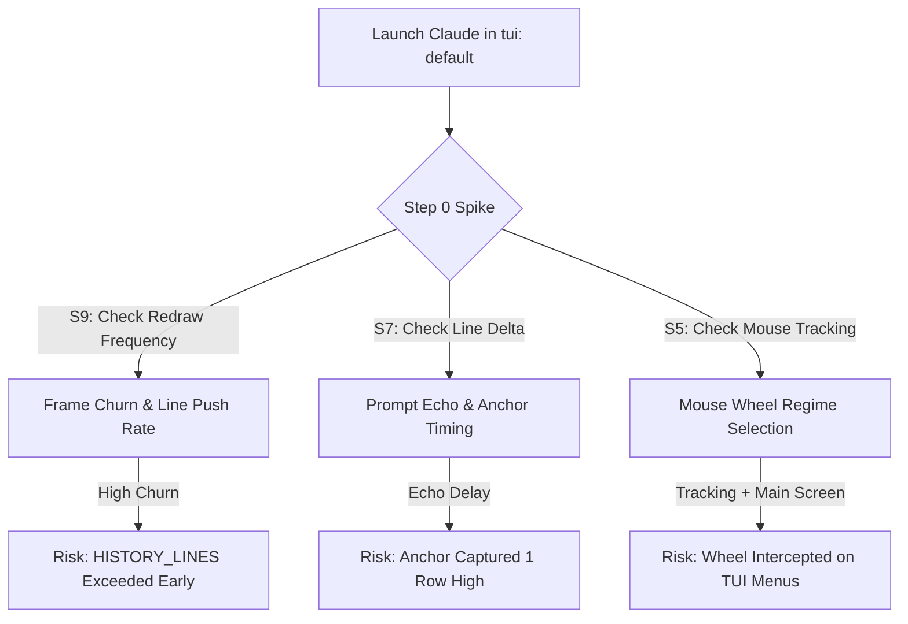

# Architectural Review: Terminal Scrollbar & Prompt Milestones Plan

**Reviewed Plan:** [`TERMINAL-SCROLLBAR-PLAN.md`](file:///C:/Users/Mario/ai-hive/TERMINAL-SCROLLBAR-PLAN.md)  
**Target Codebase:** AI Hive ([`app/widgets/terminal_view.py`](file:///C:/Users/Mario/ai-hive/app/widgets/terminal_view.py), [`app/widgets/terminal_card.py`](file:///C:/Users/Mario/ai-hive/app/widgets/terminal_card.py), [`app/terminal_agent.py`](file:///C:/Users/Mario/ai-hive/app/terminal_agent.py), [`app/session_hook.py`](file:///C:/Users/Mario/ai-hive/app/session_hook.py))  
**Reviewer:** Antigravity AI  
**Date:** August 9, 2026  

---

## Executive Summary & Overall Verdict

> [!IMPORTANT]
> **Verdict: APPROVED FOR STEP 0 (SPIKE GATE)**
> The plan is exceptionally well-researched, structurally sound, and production-ready. It correctly identifies the root cause of empty scrollback in Claude Code sessions (`tui: "fullscreen"` alt-screen renderer) and proposes a clean architectural solution using `tui: "default"` without altering terminal column geometries or polluting persistent session states.

### Key Highlights
- **Spike-First Gate Strategy (Step 0)**: Defines an offscreen validation harness with 9 empirical assertion gates ($S1–S9$) to verify VT stream behavior before writing UI code.
- **Zero-Column Overlay Design**: Keeps standard terminal grid dimensions intact (`cols` calculation untouched) by childing the scrollbar directly to `TerminalView`.
- **Clean Model/View Separation**: Stores stream-relative marker models (`PromptMark`) on `TerminalAgent` while keeping UI coordinates transient on `TerminalView`.
- **Native Component Extension**: Subclasses `QScrollBar` directly to reuse AI Hive's theme engine, smooth scrolling, drag mechanics, and hover tokens without code duplication.

---

## Technical Deep Dive: Strengths & Design Excellence

### 1. Root Cause Isolation & Solution Choice
Claude Code defaults to an alt-screen renderer (`?1049h`), redrawing output frames in place. Consequently, pyte's `HistoryScreen` stays empty (`len(screen.history.top) == 0`). 
By discovering `tui: "default"` in `claude.exe`'s CLI schema, the plan takes back scrollback control at the source, allowing standard output lines to flow into pyte's scrollback buffer naturally.

### 2. Segmented Re-Anchoring across Rebuilds
Card retiling and rebuilds create a fresh `TerminalView` where `.pushed` resets to 0. 
The plan addresses coordinate drift by storing cumulative PTY stream offsets (`_pty_total`/`_pty_dropped`) on `TerminalAgent` and re-feeding `agent.pty_replay()` in segments split at marker offsets during card restoration ([`terminal_card.py`](file:///C:/Users/Mario/ai-hive/app/widgets/terminal_card.py)).

### 3. Strict Prompt Marker Filtering
To avoid rendering dots for automated task deliveries or interactive selection menus, the plan restricts prompt capture to:
- Bare-Enter in `keyPressEvent` (excluding `Shift`/`Ctrl`/`Alt` combinations).
- Active prompt text checks (filtering out option menus matching `_NUM_OPTION_RE` or `❯` carets).
- Bypassing programmatic sends (`deliver_task`, `nudge`, scheduled actions).

---

## Critical Edge Cases & Risk Analysis

While the architecture is solid, execution should pay close attention to three specific areas during Step 0 and Phase 3:

### Risk 1: Frame Churn & History Bloat in `tui: "default"` (Spike Gate S8/S9)
* **Context**: In main-screen mode (`tui: "default"`), status spinners, token counters, and tool execution boxes repaint directly to the primary screen buffer.
* **Potential Issue**: If Claude Code repaints spinner frames frequently, each line wrap/scroll will push intermediate frames into `pyte`'s `history.top`.
* **Impact**: `history.top` could accumulate duplicate intermediate frames, causing `HISTORY_LINES = 2000` to fill up rapidly over a long session.
* **Action Item**: During Gate S8 & S9 of the Step 0 spike, measure history growth over 10–20 turns. If line churn is excessive, evaluate raising `HISTORY_LINES` or implementing an adjacent duplicate line filter in stdout line pushes.

### Risk 2: PTY Echo Timing in `_replay_with_marks` (Phase 3)
* **Context**: `_pty_total` records total bytes received *prior* to the Enter keystroke.
* **Potential Issue**: The user's typed prompt text and trailing `\r\n` are echoed back by PTY stdout *after* `mark.pos` is recorded.
* **Impact**: Splitting `replay[pos:off]` exactly at `off = mark.pos` will place the echoed prompt text into the *subsequent* segment, causing `anchor_line()` to record the line immediately *above* the user's prompt.
* **Action Item**: When anchoring during replay, ensure the segment includes the echoed prompt line (up to the `\r\n` echo) before reading `anchor_line()`, or rely on the proposed `lead=2` scroll padding.

### Risk 3: Mouse Wheel Behavior on Main-Screen Menus (Phase 6)
* **Context**: Phase 6 adjusts `wheelEvent` precedence to require `self._mouse_tracking and self._alt_screen` before forwarding wheel events to the child app.
* **Potential Issue**: When `_alt_screen` is `False` in `tui: "default"`, mouse wheel events will drive AI Hive's scrollbar rather than being forwarded as SGR mouse reports to the child application.
* **Impact**: If an inline menu rendered by Claude Code in main-screen mode supports mouse wheel scrolling, wheel events will scroll AI Hive's view instead of the menu items.
* **Action Item**: This design choice is acceptable (matching Windows Terminal and xterm behavior). Confirm during Gate S5 whether any standard Claude Code menus rely on wheel scrolling when in `tui: "default"` mode.

---

## Phase-by-Phase Execution Assessment

| Phase | Description | Risk Level | Recommendation |
|---|---|---|---|
| **Step 0** | Offscreen Spike & Assertion Gates (S1–S9) | Low | **Execute First.** Mandatory gate before any UI changes. |
| **Phase 1** | `TerminalView` Identity & Signals (`viewChanged`, `promptSubmitted`) | Low | Safe. Monotonic `pushed` logic is clean. |
| **Phase 2** | `TerminalScrollBar` Widget (`QScrollBar` subclassing) | Low | Straightforward. Overlay paint logic is well-contained. |
| **Phase 3** | Marker Model (`TerminalAgent`) & Re-anchoring | Medium | Verify PTY prompt echo timing during segmented replay. |
| **Phase 4** | Reset Semantics (`/clear`, `SessionStart`, ED 3) | Low | Reuses authoritative hook triggers cleanly. |
| **Phase 5** | Card Layout & Childing | Low | Zero stolen columns; overlay geometry is handled in `_place_overlay`. |
| **Phase 6** | `tui: "default"` Injected via `--settings` | Medium | Injects cleanly into settings JSON; check escape hatch toggle in `TopBar`. |
| **Phase 7** | Performance Tuning (Debounced signals, view state caching) | Low | High ROI optimizations for view state cache. |
| **Phase 8** | Smoke Tests & Verification | Low | 14 headless unit tests cover the full feature surface. |

---

## Conclusion & Next Steps

The plan in [`TERMINAL-SCROLLBAR-PLAN.md`](file:///C:/Users/Mario/ai-hive/TERMINAL-SCROLLBAR-PLAN.md) represents an exemplary software design document. It balances deep diagnostics of VT terminal emulation internals with clean Qt UI architectural patterns.

### Recommended Immediate Actions:
1. Run **Step 0 Spike** in `%TEMP%\aihive-tui-spike\`.
2. Confirm Gate S4 (`_CLAUDE_READY_HINTS` detection) and S9 (frame churn rate).
3. Proceed with Phases 1–3 upon successful spike completion.
