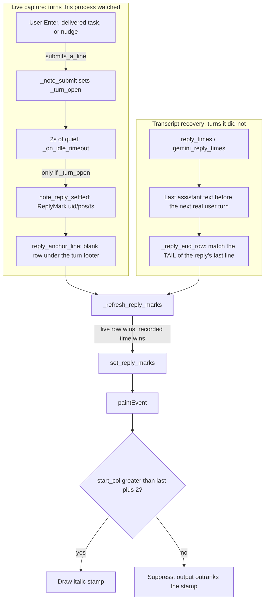

# Reply timestamps in the terminal

Reference spec for the inline "this reply finished at" stamps AI Hive draws
under each completed agent turn.

Code: `app/terminal_agent.py`, `app/transcripts.py`,
`app/widgets/terminal_card.py`, `app/widgets/terminal_view.py`.

CLAUDE.md is the documentation of record for the invariants. This file expands
on the mechanism and carries the open issues; where the two disagree, CLAUDE.md
wins and this file is wrong.

---

## 1. What the user sees

A dim italic `Aug 19, 19:14`, right-aligned into the blank row under a finished
turn, roughly where Claude's own "Crunched for 58s" footer sits. It is never a
row of our own: pyte has no way to insert one without shifting every anchor
below it, so the stamp is painted into the empty right-hand tail of a row that
already exists.

The date is always carried, even for a reply from today. The card header used
to have a `#CardReplyTime` badge and it was removed at the user's request, so
this is the only reply-time surface left, and a bare `19:14` on a conversation
reopened three days later reads as "just now". That was the original complaint,
verbatim: "if i open the app, i only get to see the current time instead of
when the answer was actually generated."

---

## 2. Architecture and data flow



### Files and roles

| File | Component | Role |
|---|---|---|
| `app/terminal_agent.py` | `TerminalAgent`, `ReplyMark` | Owns the turn latch, mints and moves marks at the busy to idle edge, caps them FIFO at 200. |
| `app/transcripts.py` | `reply_times`, `gemini_reply_times` | Reads finished-reply times off the CLI's own JSONL. Tail-bounded, cached on (mtime, size). |
| `app/widgets/terminal_card.py` | `TerminalCard` | Anchors marks to rows, recovers the ones it never watched, merges the two sources, formats the string. |
| `app/widgets/terminal_view.py` | `TerminalView` | Finds the anchor row (`reply_anchor_line`), paints the stamp, owns the collision rule. |

---

## 3. Coordinates

Two coordinate spaces are in play and mixing them up is silent by
construction, so keep them straight.

**Absolute line ids**, for anything anchored to a row:

```
abs_line(visual row r) == history.top.pushed - scroll_offset + r
```

`pushed` counts every line that has ever rolled off the top into history. It is
strictly monotonic and is deliberately not reset by a history wipe, which is
what keeps ids stable across a `/clear`. Rendering inverts it: the visible row
for absolute line `L` is `L - (pushed - offset)`.

Note the sibling space. `_input_block_span` and `cursor.y` are live buffer rows,
so `anchor_line()` is `pushed + row` with no offset term. The two agree at
offset 0 and nowhere else.

**Stream offsets**, for anything that has to survive a card rebuild.
`ReplyMark.pos` is a character offset into the agent's raw pty stream, not a
line. A retile or a workspace switch throws the `TerminalView` away and the new
one starts at `pushed == 0`, so no absolute line the old view produced is
portable. `TerminalCard._replay_with_marks` splits the replay at those offsets
and calls the same `reply_anchor_line()` the live path called, over the same
screen state, which is what makes the two agree.

`uid` is a monotonic counter and never `id()`. Marks are FIFO-capped and
CPython reuses an address after collection, so a dropped mark would hand its id
to a new one and silently donate its row.

---

## 4. Live capture

### 4.1 A stamp needs a turn somebody asked for

This is the central design decision of the feature and the one that is easiest
to delete by accident.

A busy to idle settle is `BUSY_IDLE_MS` (2 s) of quiet and nothing more. A
`--resume` launch produces several that are not replies at all: Claude prints
its banner and pauses while it loads the transcript, reprints the whole past
conversation and pauses again, and `settle_layout` then hands each card its
real width, which makes a full-screen TUI redraw its entire frame. Every one of
those looks exactly like a reply ending. Stamping them with `time.time()`
rewrote the last reply in every terminal to the moment the app was opened. That
was reported live, twice.

So the precondition is a fact, not a classifier. `TerminalAgent._turn_open` is
set by `_note_submit`, which runs only when a line was genuinely submitted to
the child: a bare CR from the user's Enter (`write`), or the delayed CR that
every `deliver_task` and `nudge` sends 350 ms after its text
(`_write_task_to_pty`). `submits_a_line` drops a CR inside a bracketed paste
and the ESC-CR / LF that Shift+Enter and Ctrl+Enter send, because those insert
a newline instead of submitting. It is reset in `start()` and `restart()`.

An earlier attempt used a one-shot `_settled_once` to suppress exactly one
settle per resumed launch. It did not survive a second burst. Do not go back to
inferring which settle is a replay.

`activity_changed.emit(False)` still fires on every settle. The busy/idle UI
state is correct either way; only the reply-time side effect is gated.

### 4.2 One stamp per turn, moved to where the reply ended

Claude falls quiet mid-reply whenever a tool runs longer than the idle window,
and each of those lulls used to mint its own mark, so one long reply wore a
stamp at every pause it happened to take. `note_reply_settled` checks whether
this turn already owns the tail mark (`_turn_mark_uid`) and, if so, mutates its
`pos` and `ts` instead of appending. `_note_submit` clears `_turn_mark_uid` so
the next turn starts a fresh one.

Two consequences. The latch is deliberately not cleared when a mark is minted,
and `TerminalCard._on_reply_mark_added` re-anchors the newest mark on every
`reply_marks_changed` rather than only the first time it sees a uid. The stamp
has to follow the mark forward. When the anchor cannot be found the mark keeps
the row it already had, so a settle on an awkward screen never costs a stamp
that was already placed.

Marks are minted whether or not a card exists. A hidden workspace keeps
executing per the model-owns-processes invariant, and its reply history has to
be there via `reply_replay_marks()` whenever a card is next built.

### 4.3 Finding the row

`TerminalView.reply_anchor_line()` scans up from the top row of the input box
Claude redraws at settle, bounded by `_REPLY_ANCHOR_SCAN` (6 rows), and returns
the blank row below the first real content row it finds.

It skips blanks, rule rows (`_row_is_rule`) and the box's own hint line
(`_row_is_input_footer`). The rule skip is load-bearing: the box's top border
sits directly above the prompt row, and an earlier version returned None at the
first rule, which is the very first row it looks at on a real screen. The live
stamp therefore never appeared at all, and every stamp anyone saw came from
recovery. The fixture missed it because it fed "footer, blank, prompt" with no
border, a shape Claude never draws.

It targets the first content row rather than testing for the footer
specifically. `is_reply_footer` is used by the recovery path, not here. The
6-row bound is what stops a missing footer from walking back into unrelated
older history and mislabelling it.

None means no stamp. There is no fallback anchor, on purpose. See section 10.

---

## 5. Transcript recovery

A live mark only exists for turns this process watched finish, so a restored
conversation comes back with none, and that is the conversation long enough to
want stamps in. Without recovery a reopened hive shows no reply time anywhere.
Claude timestamps every record it writes, so the file knows what no live
observation can.

### 5.1 What counts as a finished reply

`transcripts.reply_times(cwd, session_id)` returns `(epoch, final text)` oldest
first. A finished reply is the last assistant record carrying text before the
next real user turn, not every assistant text record: a turn narrates between
its own tool calls and those are mid-reply. Tool results come back as `user`
records, so `_is_tool_result` excludes them from being a boundary. Sidechains
are skipped (a sub-agent's turn is not this conversation's reply) and so is a
record with no parseable timestamp, since a stamp reading 1970 is worse than
none.

Tail-bounded at `_REPLY_TAIL_BYTES` (256 KiB) with a full-scan fallback, cached
on (mtime, size). Both consumers only ever ask about replies still on screen,
and the scrollback reaches back a few turns at most, so the bound costs nothing
real.

Gemini rides `gemini_reply_times(session_id)` against its own transcript.

### 5.2 Placing them

`TerminalCard._reply_end_row` matches the last `_REPLY_TAIL_CHARS` (16)
characters of the reply's final line against normalized scrollback rows, and
requires the row below to be blank. Two measurements forced that shape.

Claude's "<verb> for Ns" footer, what a live mark anchors to, does not survive
per turn into the scrollback. The renderer erases that region when the next
turn starts, so footer-anchoring history is a dead end.

Matching the reply's head found a stale narrower re-render first. pyte does not
reflow, so a card resized mid-session keeps both copies of a reply, the older
one truncated wherever the redraw overwrote it, and the head match stamped the
middle of a paragraph. The tail is usually missing from a truncated copy, the
blank-row test rejects it when it is not, and the blank row is also the only
row the stamp reliably renders on.

Markdown is stripped from both sides (`_norm_reply_line`) because the renderer
restyles inline code and bold rather than printing the syntax characters. The
scan carries on below each hit so replies match in file order and a repeated
closing line cannot claim an earlier reply's row.

A footer directly below the blank row moves the anchor down past it, so a
recovered stamp and a live one land in the same place relative to the footer.

It fails by being absent, never wrong. A reply that scrolled out of reach
yields no stamp rather than a guessed line.

### 5.3 When recovery runs

Recovery rides a projection, which is right: the scan has to run against the
screen the marks will be drawn on. The launch autostart has no usable one.
`drop_restored_screen` cancels the settled-size projection for every agent it
is about to start, `_reproject_on_size` bails while the history is still empty,
and `settle_layout` sizes the card before the child is spawned. So a restored
running card's only projection is the constructor's, which runs before the
child has printed a byte, and the conversation then arrives seconds later from
`--resume` with nothing left to scan it.

`_rescan_recovery` hangs off the settle (`_on_activity`) to cover that. It is
bounded twice: it runs only while nothing has been recovered yet, and gives up
after `_RECOVER_RESCAN_TRIES` (6). Stopping on the first success is safe
because the reprint lands in one go.

The transcript texts are cached per conversation under `_recover_key`
(provider, cwd, session_id), shared with the prompt recovery, so one
conversation costs one read of each. A `/clear` or a pin change rotates the key.

---

## 6. Merging the two sources

`TerminalCard._refresh_reply_marks` merges by row. Where a live mark and a
recovered one are the same reply, the live mark keeps the row and the
transcript supplies the time.

The split is deliberate. A live mark anchored the screen it was looking at, so
its row is right. But it read the wall clock at the settle, which is a couple
of seconds late at best and flatly wrong for any settle that was not a reply.
The record outranks the clock. That is also what makes a stray live stamp
self-correcting: the next projection recovers the same reply and the recorded
time replaces the observed one.

Do not put the clock back on top. The whole class of bug here is a live
observation overwriting a historical fact.

"The same reply" is the nearest row within `_STAMP_MERGE_SLACK` (3), not an
exact match. The two anchors agree on the ordinary screen, but fall back to
different rows when the row under Claude's footer is not blank: recovery takes
the blank row above the footer, the live path takes the footer row itself.
Requiring equality kept both, so one reply wore two stamps a couple of rows
apart reading different times, and the live one, whose time is only an
observation, is the one that renders. Matching is greedy over the live marks in
row order and each recovered reply is claimed at most once, so a recovered stamp
can never be counted twice or absorb a neighbouring turn's.

The string is built at refresh time, not capture time, by `_format_reply_stamp`
(`"%b %d, %H:%M"`), so a stamp minted today still renders correctly once the
day turns over.

---

## 7. Rendering

In `TerminalView.paintEvent`, after the text runs:

No buffer injection. Nothing synthetic is ever written into `self.screen` or
pyte's deque; the stamp exists only in the paint pass.

Right-aligned into the row's blank tail. With `last` the index of the rightmost
non-space cell on the row:

```
start_col = cols - len(text) - 1
draw only if start_col > last + 2
```

If it does not fit, the stamp is suppressed outright. Not clipped, not
overlapped. Better to silently miss a stamp than draw over real output.

Drawn italic in `legible_color(Palette.CARDHEAD_SUB, Palette.BG_CONSOLE)`, so it
follows the active skin and stays legible on a light theme.

---

## 8. Lifetime and resets

Marks are transient and never persisted. `reply_marks_changed` must never reach
a save. The transcript is the durable record, and a stored marker list goes
stale the same way a stored limit latch does.

FIFO-capped at `REPLY_MARK_CAP` (200) per agent.

Every reset path that wipes `PromptMark`s wipes `ReplyMark`s in the same tick:
`TerminalAgent.restart()`, `note_conversation_replaced()` (the primary `/clear`
edge, since the classic renderer emits no ED 3 and simply reprints the banner),
and `TerminalCard._on_history_cleared` (the secondary history-shrink edge).

---

## 9. Open issues and recommended changes

Two are already fixed and are kept here only as the reasoning behind code that
now looks arbitrary. `set_marks` and `set_reply_marks` call `self.update()`
because `_notify_view` reaches the scrollbar and not the paint queue, and a
stamp minted 2 s after the last output has no other repaint coming.
`_refresh_reply_marks` merges within `_STAMP_MERGE_SLACK` because the two
anchors fall back to different rows on a screen whose footer has content under
it. Both are covered by `test_reply_stamp_repaint_and_merge`.

What follows is still open, ranked by importance: what the user notices first, then what is wrong but
quiet, then what keeps the code from breaking again. Each carries its cause
and why it matters, so a reader can decide without re-deriving the history.

### Issue 1: the live mark reads the wall clock

`note_reply_settled` writes `time.time()`, and `_refresh_reply_marks` exists
partly to overwrite it later. The code has two answers and knowingly shows the
worse one first. Worse, the correction rides a projection: no resize and no
rebuild means no correction, and the number just stays off.

`reply_times` is tail-bounded, cached, and measures single-digit milliseconds.
`note_reply_settled` runs once or twice per turn per agent, not per burst. Ask
for the recorded time first and keep the clock as the fallback for a transcript
that has not flushed yet and for providers that have none:

```python
ts = self._recorded_reply_time() or time.time()
```

Worth carrying a `ts_from_record: bool` on `ReplyMark` so the merge can prefer a
recorded live mark without re-deriving which is which. This deserves its own
branch: it changes what a live stamp means.

### Issue 2: the reply recovery cannot load its own data

The transcript read and the `_recover_key` rotation both live inside
`_recover_marks`, including `_recover_replies`, which only `_recover_reply_marks`
uses. `_recover_reply_marks` opens with `if not self._recover_replies: return`
and has no way to fill it.

Both current call sites happen to run them in the right order, so it works.
Nothing says so. If someone reorders them or adds a third caller, the failure
mode is no stamps at all, which is exactly the symptom this feature has already
been reported broken with. Pull the load into a `_load_recovery()` called at the
top of each.

### Issue 3: no captured screens in the tests

Every fixture screen in `tests/smoke_test.py` is hand-typed from a description
of the renderer, and the measurements behind the anchor logic were run against
`.vt` captures that live outside version control. That is how the live anchor
shipped dead against a green suite, on a screen shape Claude never draws.

Check two or three anonymized captures into `tests/fixtures/` and drive
`reply_anchor_line`, `_reply_end_row` and `is_reply_footer` off them. It is the
only way this class of bug stops recurring, and it turns the numbers in section
12 from claims into a regression check.

### Issue 4: two copies of one mark system

`PromptMark`/`ReplyMark`, `_mark_lines`/`_reply_mark_lines`,
`_refresh_marks`/`_refresh_reply_marks`, `_recover_marks`/`_recover_reply_marks`,
`clear_prompt_marks`/`clear_reply_marks`, `replay_marks`/`reply_replay_marks`.
Same uid and pos discipline, same cap, same never-persisted contract, same reset
set.

There are exactly two real differences: the anchor function, and the merge rule
(live text wins for prompts, recorded time wins for replies). Everything else is
duplication, and duplication is why "wipe both in the same tick" has to be
written down as an invariant instead of being true by construction.

A single `StreamMark(uid, pos, ts, payload)` with a kind and a small table of
(anchor fn, merge fn) per kind collapses roughly 150 lines and makes the reset
symmetry structural. Big change, own branch, full suite green either side.

### Issue 5: year-ambiguous stamps

`Aug 25, 11:48` on a recovered reply from a previous year is ambiguous. Four
lines, and it fits the existing rule that the string is built at refresh time:

```python
def _format_reply_stamp(ts: float) -> str:
    dt = datetime.datetime.fromtimestamp(ts)
    if dt.year != datetime.datetime.now().year:
        return dt.strftime("%b %d %Y, %H:%M")
    return dt.strftime("%b %d, %H:%M")
```

### Issue 6: `_mark_lines` and `_reply_mark_lines` are never pruned

Both dicts are only reset wholesale by `_replay_with_marks` or
`_on_history_cleared`. The agent's own lists are FIFO-capped at 200, so past
200 replies in one conversation the card accumulates entries for uids that can
never resolve again. `_refresh_*` already filters them on read, so this is a
slow leak rather than a correctness bug, and the fix is free: delete the stale
keys in the comprehension that already skips them.

### Issue 7: optional, only if it measures

`_scrollback_rows` is read once and shared, but `_recover_marks` then normalizes
all ~2200 rows with `_norm_line` and `_recover_reply_marks` normalizes the same
rows again with `_norm_reply_line`. One loop producing both halves that work.

Separately, `_reply_end_row` does `tail not in lines[i]` for every reply against
every row. If the rendered row genuinely ends with the reply's tail, which is the
definition of the reply's last row, an `endswith` against a dict keyed on each
row's last 16 characters turns the scan into a lookup and is a stricter match
besides. Measure first: the substring form is deliberately loose and the current
cost is already bounded by `_RECOVER_RESCAN_TRIES`.

A related micro-optimization: `paintEvent` rebuilds the line-to-text dict from
`self._reply_marks` on every paint. Pre-index it once in `set_reply_marks`
instead. Keep one source of truth if you do, or the list and the map will
drift.

---

## 10. Rejected changes

Written down so they stop being re-proposed. Each of these looks like an
improvement and reverses a decision that was already paid for.

**Falling back to `%H:%M` on a narrow card.** Re-creates the original complaint:
with the header badge gone, a bare time on a conversation reopened days later
reads as "just now". If a full stamp does not fit, suppressing it is the correct
outcome. Re-parsing the formatted string with `split(", ")` is the wrong shape
besides; pass the epoch.

**A fallback anchor when `_input_block_span()` returns None.** Scanning up from
the bottom row instead anchors to whatever is there, which on a settle is often
a menu the agent is parked on. Absent beats wrong is the contract both anchor
paths keep.

**Extending a replay segment past the submit echo** in `_replay_with_marks` to
catch the reprinted prompt. Breaks the symmetry between live capture and replay,
which is the entire reason both sides call the same anchor function.

**Relaxing the blank-row requirement in `_reply_end_row`.** It is what rejects
the stale narrower re-render that head matching stamped into the middle of a
paragraph.

**Persisting marks.** They go stale exactly like a stored limit latch. The
transcript is the durable record.

**Inferring which settle is a replay** (the old `_settled_once`). A one-shot
classifier cannot survive a second burst. The submit latch is a fact; this was a
guess.

---

## 11. Invariants

1. No buffer injection. Stamps exist only in `paintEvent`. Nothing synthetic is
   written into `self.screen` or pyte's history deque.
2. Output outranks the stamp. The `start_col > last + 2` guard never comes out.
3. A stamp needs a submitted turn. `_turn_open` gates the mint, and nothing but
   a real submit sets it.
4. One stamp per turn, moved forward, not one per settle.
5. The record outranks the clock. A recovered time replaces an observed one,
   never the reverse.
6. Absent beats wrong. Every anchor path returns None rather than guessing a row.
7. Absolute line ids stay monotonic across a history wipe; `pos` is the only
   coordinate that survives a card rebuild.
8. Marks are transient. `reply_marks_changed` must never reach a save.
9. Prompt marks and reply marks reset in the same tick, on every reset path.
10. The stamp always carries the date.

---

## 12. Provenance

Numbers quoted here come from measurements recorded in the module docstrings and
CLAUDE.md: `reply_times` at 0.3 to 2.7 ms on real 1 to 3 MB transcripts,
`typed_prompts` at 90 to 165 ms for its full scan, the recovery scan at ~35 ms
over a full 2000-row history, and tail matching anchoring 11 of 15 replies
against 4 of 13 for head matching, across seven captured screens at five widths.

Those captures are not in version control, so none of it can currently be
re-run. See issue 3.
